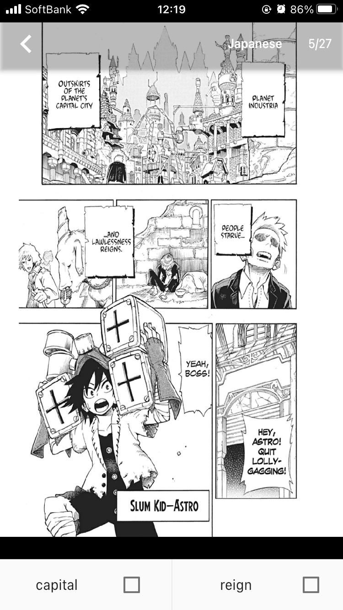
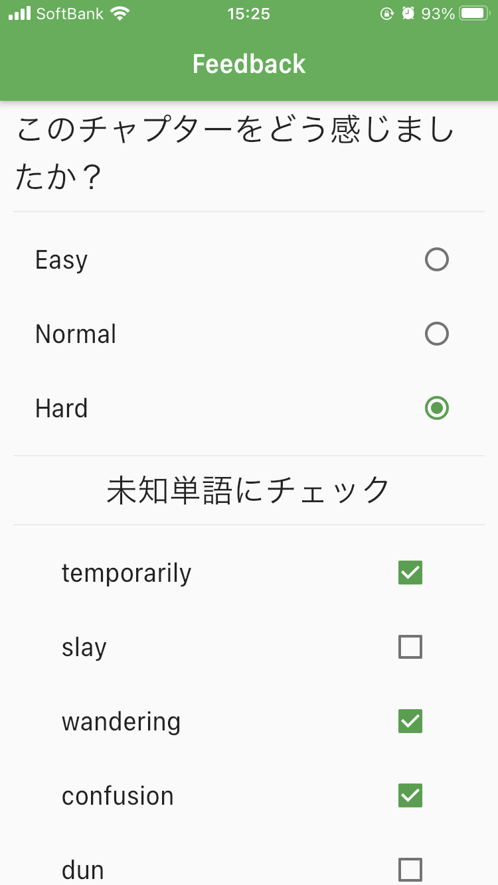
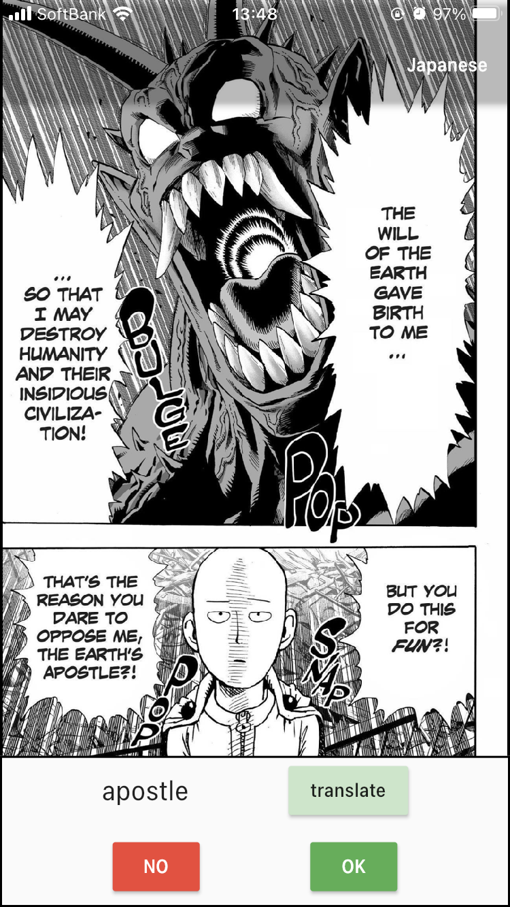

# Manga Vocabulometer

漫画英訳本を教材として，英語学習を行うスマートフォンアプリケーションです．

# 使用技術
- Flutter
- firebase
  - バックエンドとして使用
- Python
  - データセット作成等に使用

# アプリについて
## 初期設定
  
  San Diego Quick Assessmentに従って，学習者の英語能力を判定します．
## 読書
  
  漫画は英語版，日本語版の両方を読むことができます．また，画面下部にはページに含まれる単語が表示されます．ここで選択された単語は後の復習用単語として記録されます．

   

## フィードバック
  読了後に，図のような画面に遷移します．漫画に対する主観的な難易度を選択してもらいます．選択され難易度にしたがって，未知単語と推定された単語が表示されます．ここでも未知単語の選択を行うことができます．

   

## 復習
  
  読書によって記録された未知単語をその単語が出現する漫画画像とともに復習することができます．

  

- [Lab: Write your first Flutter app](https://flutter.dev/docs/get-started/codelab)
- [Cookbook: Useful Flutter samples](https://flutter.dev/docs/cookbook)

For help getting started with Flutter, view our
[online documentation](https://flutter.dev/docs), which offers tutorials,
samples, guidance on mobile development, and a full API reference.
